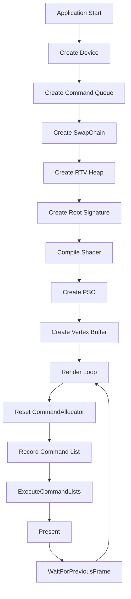

<!--more-->

# Creating a Basic Direct3D 12 Component

> 基于 Microsoft Learn《Creating a Basic Direct3D 12 Component》整理，采用 PaperMod + GitHub Flavored Markdown 风格。

https://learn.microsoft.com/en-us/windows/win32/direct3d12/creating-a-basic-direct3d-12-component?source=recommendations

https://github.com/Microsoft/DirectX-Graphics-Samples

## 前言

Hello Triangle 并不仅仅是在屏幕上绘制一个三角形，它完整展示了 Direct3D 12 最核心的对象模型：

- Device
- Command Queue
- Swap Chain
- Descriptor Heap
- Root Signature
- Pipeline State Object（PSO）
- Command List
- Fence

理解这一生命周期，就理解了 D3D12 的基本运行方式。

---

# 生命周期



---

# 初始化

初始化主要分为两部分：

## Pipeline

- 创建设备（Device）
- 创建 Command Queue
- 创建 SwapChain
- 创建 RTV Heap
- 创建 Render Target
- 创建 Command Allocator

## Assets

- Root Signature
- Shader
- Input Layout
- Pipeline State Object
- Vertex Buffer
- Fence

---

# Render 流程

每帧流程如下：

```text
Reset CommandAllocator
        ↓
Reset CommandList
        ↓
Set Root Signature
        ↓
Resource Barrier
(Present → RenderTarget)
        ↓
Clear RTV
        ↓
Draw Triangle
        ↓
Resource Barrier
(RenderTarget → Present)
        ↓
ExecuteCommandLists
        ↓
Present
        ↓
WaitForPreviousFrame
```

---

# Resource Barrier

Back Buffer 具有状态。

渲染前：

```
PRESENT
```

绘制前必须转换：

```
RENDER_TARGET
```

绘制完成后再次转换：

```
PRESENT
```

因此每帧都会执行两次 Resource Barrier。

---

# CPU / GPU 同步

CPU 与 GPU 是异步工作的。

```text
CPU:
Frame1
Frame2
Frame3
Frame4

GPU:
Frame1
Frame2
```

Fence 用于保证 GPU 已完成当前资源访问，避免 CPU 提前修改或释放资源。

同步流程：

```text
Signal Fence
      ↓
GPU Execute
      ↓
Fence Complete
      ↓
CPU Continue
```

---

# 对象依赖关系

```text
Device
 └── Command Queue
      └── SwapChain
           └── RTV Heap
                └── Render Target
                     └── Command Allocator
                          └── Command List
```

---

# 核心 API

## 初始化

- D3D12CreateDevice
- CreateCommandQueue
- CreateSwapChain
- CreateDescriptorHeap

## Pipeline

- CreateRootSignature
- D3DCompileFromFile
- CreateGraphicsPipelineState

## Rendering

- ResourceBarrier
- ClearRenderTargetView
- DrawInstanced
- ExecuteCommandLists
- Present

## Synchronization

- Signal
- SetEventOnCompletion
- WaitForSingleObject

---

# 总结

Hello Triangle 的真正意义不是绘制一个三角形，而是展示 Direct3D 12 的完整工作流水线：

1. 初始化 GPU 对象
2. 配置图形管线
3. 上传资源
4. 录制命令
5. 提交 GPU 执行
6. CPU/GPU 同步
7. 进入下一帧

掌握这一流程后，就可以进一步学习纹理、深度缓冲、多缓冲、Compute Shader、Ray Tracing 等高级主题。
