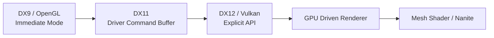

<!--more-->

# Graphics API 过去 20 年的发展

> Graphics API 的演进，并不仅仅是 **DX9 → DX11 → DX12**。
>
> 更准确地说，它经历了 **Renderer Ownership（渲染控制权）** 的不断迁移：
>
> **Driver → Application → GPU**

---

# 总览



---

# 第一阶段：Immediate Mode（DX9 / OpenGL）

## 架构

```text
Application
      │
      ▼
DX Runtime
      │
      ▼
Driver
      │
      ▼
GPU
```

---

## 典型代码

```cpp
SetTexture();

SetShader();

SetBlend();

Draw();
```

---

## Driver 工作

每次 Draw 前：

Driver 都需要：

- Validate State
- Shader Binding
- Blend State
- Rasterizer State
- Pipeline Build

CPU 大量时间消耗在：

```
Driver Validation
```

而不是：

GPU。

---

## 特点

| 项目 | 描述 |
|------|------|
| API 风格 | Immediate Mode |
| Driver 工作量 | 非常大 |
| Pipeline | Driver 动态组合 |
| CPU 开销 | 高 |
| GPU 提交 | Driver 控制 |
| Draw Command | CPU |

---

# 第二阶段：Driver Command Buffer（DX11）

DX11：

最大的变化：

不是 GPU Driven。

而是：

Driver：

开始：

维护：

Command Buffer。

---

## 架构

```text
Application

↓

Immediate Context

↓

Driver Command Buffer

↓

GPU
```

---

## 改进

CPU：

不用：

每个 Draw：

都等待 GPU。

Driver：

可以：

缓存：

Command。

---

## 但是

Driver：

仍然：

负责：

- State Validation
- Pipeline Build
- State Merge

CPU：

仍然：

大量：

进入：

Driver。

---

## 特点

| 项目 | 描述 |
|------|------|
| Driver | 仍然很重 |
| CPU | 仍然依赖 Driver |
| Pipeline | Driver 动态创建 |
| Draw Command | CPU |
| Visibility | CPU |

---

# 第三阶段：Explicit API（DX12 / Vulkan / Metal）

这是现代 Renderer 的真正起点。

Driver：

开始退出。

Application：

自己：

管理：

Pipeline。

---

## 架构

```text
Application

↓

PSO

↓

Command List

↓

ExecuteCommandLists()

↓

GPU
```

---

## 新增概念

- PSO
- Command List
- Descriptor Heap
- Fence
- Explicit Resource State

---

## 最大变化

Driver：

不再：

负责：

Pipeline。

而是：

Application：

提前：

创建：

PSO。

运行时：

只有：

```cpp
SetPipelineState();

Draw();
```

---

## 特点

| 项目 | 描述 |
|------|------|
| Driver | 很轻 |
| Pipeline | PSO |
| CPU | 自己管理资源 |
| Draw Command | CPU |
| Visibility | CPU |

---

# 第四阶段：GPU Driven Renderer

真正的革命：

不是：

PSO。

而是：

GPU：

开始：

拥有：

Visibility。

---

## 架构

```text
CPU

↓

GPU Scene

↓

Compute Shader

↓

GPU Visibility

↓

ExecuteIndirect

↓

Rasterizer
```

---

## CPU 不再负责

CPU：

不再：

生成：

Visible Draw List。

GPU：

自己：

完成：

- Instance Culling
- Visibility
- Draw Arguments

---

## ExecuteIndirect

CPU：

只需要：

```cpp
ExecuteIndirect();
```

GPU：

自己：

读取：

```
Indirect Buffer
```

决定：

真正：

Draw：

哪些：

对象。

---

## 特点

| 项目 | 描述 |
|------|------|
| Visibility | GPU |
| Draw Arguments | GPU |
| Draw Submission | GPU |
| CPU | Dispatch Compute |
| Driver | 极少参与 |

---

# 第五阶段：Mesh Shader / Nanite

真正：

Geometry：

开始：

GPU Driven。

---

## 传统 Renderer

```
Mesh

↓

Draw Mesh
```

---

## Nanite

```
Mesh

↓

Cluster

↓

Cluster Culling

↓

Cluster LOD

↓

ExecuteIndirect

↓

Raster
```

GPU：

不再：

以：

Mesh：

作为：

Draw Unit。

而是：

Cluster。

---

## 特点

| 项目 | 描述 |
|------|------|
| Draw Unit | Cluster |
| Visibility | GPU |
| LOD | GPU |
| Triangle Reduction | GPU |
| CPU | 基本退出 Geometry 管理 |

---

# 五个时代对比

| 对比项 | DX9 | DX11 | DX12 | GPU Driven | Nanite |
|---------|-----|------|-------|------------|---------|
| Driver 工作 | ★★★★★ | ★★★★☆ | ★☆☆☆☆ | ★☆☆☆☆ | ★☆☆☆☆ |
| PSO | ❌ | ❌ | ✅ | ✅ | ✅ |
| Command Buffer | Driver | Driver | Application | Application | Application |
| Draw Command | CPU | CPU | CPU | GPU | GPU |
| Visibility | CPU | CPU | CPU | GPU | GPU |
| Geometry LOD | CPU | CPU | CPU | CPU | GPU |
| Draw Unit | Mesh | Mesh | Mesh | Mesh | Cluster |

---

# Ownership（控制权）迁移

现代 Renderer：

最大的变化：

不是 API。

而是：

控制权。

```mermaid
flowchart TD

Driver

↓

Application

↓

GPU
```

---

## DX9

Driver：

拥有：

- Pipeline
- State
- Validation

---

## DX11

Driver：

仍然：

拥有：

- Pipeline
- Validation

增加：

- Command Buffer

---

## DX12

Application：

拥有：

- PSO
- Command List
- Resource State

Driver：

基本：

退出。

---

## GPU Driven

GPU：

拥有：

- Visibility
- Draw Command
- Draw Arguments

---

## Nanite

GPU：

进一步：

拥有：

- Geometry
- LOD
- Cluster

---

# UE 对应关系

| UE 技术 | 所属阶段 |
|----------|----------|
| Static Mesh | DX11 / DX12 |
| ISM | DrawInstanced |
| HISM | CPU Cluster Culling |
| Mesh Draw Command | DX12 |
| PSO Cache | DX12 |
| GPU Scene | GPU Driven |
| Instance Culling | GPU Driven |
| ExecuteIndirect | GPU Driven |
| Nanite | Geometry Driven |

---

# 真正的性能优化对象

很多人：

误认为：

ExecuteIndirect：

减少：

Triangle。

其实：

不是。

不同技术：

优化：

不同：

对象。

| 技术 | 优化对象 |
|------|-----------|
| DrawInstanced | CPU Draw Submission |
| PSO | Driver Overhead |
| ExecuteIndirect | Draw Command Generation |
| GPU Scene | Visibility |
| HLOD | Mesh Count |
| LOD | Triangle Count |
| Nanite | Cluster / Triangle Count |

---

# Renderer 演进真正解决的问题

| 时代 | 解决的问题 |
|------|------------|
| DX9 | 基础硬件加速 |
| DX11 | Driver Command Buffer |
| DX12 | Driver Overhead |
| GPU Driven | CPU Visibility / Draw Generation |
| Nanite | Geometry Complexity |

---

# 最终总结

现代 Graphics API 的发展，本质不是：

```
同步

↓

异步
```

而是：

```
Driver

↓

Application

↓

GPU
```

控制权：

不断：

向 GPU 转移。

最终形成：

```text
Scene

↓

GPU Visibility

↓

GPU Draw Command

↓

GPU Geometry

↓

Rasterizer
```

这也是 Unreal Engine 5、RE Engine、Snowdrop、Decima 等现代渲染架构共同的发展方向。

---

# 一张图总结


> **一句话总结：**
>
> **过去 20 年 Graphics API 的演进，本质上就是 Renderer Ownership（渲染控制权）不断从 Driver 转移到 Application，再进一步转移到 GPU 的过程。**