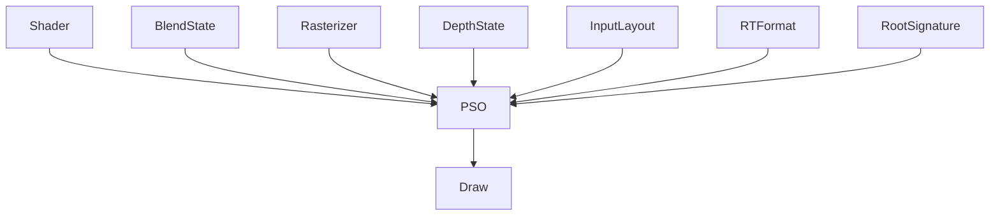

<!--more-->

# Shader 与 PSO（Pipeline State Object）关系详解

> Shader 决定 **GPU 如何计算（How to Compute）**；
>
> PSO（Pipeline State Object）决定 **GPU 如何执行（How to Render）**。
>
> 在现代图形 API（DirectX12、Vulkan、Metal）中，**PSO 的数量通常远大于 Shader 的数量**。

---

# 一句话理解

| 对象 | 职责 |
|------|------|
| Shader | GPU 程序，负责计算顶点、像素、计算着色等 |
| PSO | GPU 渲染状态快照，包含 Shader 与所有固定渲染状态 |
| Mesh Draw Command | 一条真正的 Draw Command，引用某个 PSO 去绘制某个 Mesh |

---

# Shader 是什么？

Shader 本质就是 GPU 程序。

例如：

```text
Vertex Shader (VS)

↓

Pixel Shader (PS)
```

例如：

```hlsl
VSMain()

PSMain()
```

编译后：

```text
VS.cso

PS.cso
```

Shader：

**只负责计算。**

例如：

- 顶点变换
- 光照计算
- PBR
- Shadow
- BRDF

---

# PSO 是什么？

PSO（Pipeline State Object）

本质就是：

> **一套完整的 GPU Pipeline 配置。**

一个 PSO 通常包含：

```text
PSO
├── Vertex Shader
├── Pixel Shader
├── Root Signature
├── Input Layout
├── Blend State
├── Rasterizer State
├── Depth / Stencil State
├── Primitive Topology
├── RTV Format
├── DSV Format
└── Sample Count
```

因此：

Shader：

只是：

PSO 的一部分。

---

# Shader 与 PSO 的关系



---

# 一个 Shader 可以对应多个 PSO

例如：

只有：

```text
VS_Default

PS_Default
```

但是：

Blend：

```
Opaque

Transparent
```

Raster：

```
BackFace

TwoSide
```

Depth：

```
Write

ReadOnly
```

最终：

| Shader | Blend | Raster | Depth | PSO |
|---------|--------|---------|--------|------|
| VS_Default + PS_Default | Opaque | BackFace | Write | PSO0 |
| VS_Default + PS_Default | Transparent | BackFace | Write | PSO1 |
| VS_Default + PS_Default | Opaque | TwoSide | Write | PSO2 |
| VS_Default + PS_Default | Opaque | BackFace | ReadOnly | PSO3 |

可以看到：

Shader：

没有变化。

PSO：

已经：

4 个。

---

# 一个 PSO 可以包含多个 Shader Stage

不同 Pipeline：

包含不同 Shader。

| Pipeline | Shader Stage |
|------------|--------------|
| 普通渲染 | VS + PS |
| Tessellation | VS + HS + DS + PS |
| Geometry | VS + GS + PS |
| Mesh Shader | AS + MS + PS |
| Compute | CS |

因此：

一个 PSO：

通常：

不是：

一个 Shader。

而是：

多个 Shader Stage。

---

# 为什么 PSO 比 Shader 多？

原因：

PSO：

包含：

Shader

+

Render State。

例如：

```
Shader

×

Blend

×

Raster

×

Depth

×

RT Format

×

MSAA
```

假设：

| 状态 | 数量 |
|------|------|
| Shader | 2 |
| Blend | 3 |
| Raster | 2 |
| Depth | 2 |
| RT Format | 3 |
| MSAA | 2 |

最终：

```
2 × 3 × 2 × 2 × 3 × 2

=

144 PSO
```

Shader：

只有：

2。

PSO：

已经：

144。

---

# UE5 中 Shader 与 PSO

UE 中：

关系通常如下：

```mermaid
flowchart TD

Material

↓

Shader Permutation

↓

Shader Map

↓

Pipeline State Object

↓

Mesh Draw Command

↓

Draw
```

---

# Material 与 Shader

例如：

```
M_Tree
```

可能：

生成：

```
VS

PS
```

但是：

由于：

- Base Pass
- Shadow Pass
- Depth Pass
- Velocity Pass
- Wireframe Pass

最终：

会产生：

多个：

PSO。

---

# Shader Permutation

Material：

开启：

```
Normal Map

Clear Coat

Fog

Lightmap
```

每一个：

Static Switch：

都会：

生成：

新的：

Shader。

例如：

| Feature | Shader |
|----------|---------|
| Normal ON | Shader A |
| Normal OFF | Shader B |
| Clear Coat ON | Shader C |
| Fog ON | Shader D |

最终：

Shader：

越来越多。

PSO：

更多。

---

# UE 为什么需要 PSO Cache？

如果：

运行过程中：

第一次：

遇到：

新的：

PSO。

GPU：

必须：

Compile。

于是：

玩家：

看到：

```
Shader Stutter
```

因此：

UE：

提供：

- PSO Cache
- PSO Precaching
- Shader Pipeline Cache

提前：

Compile：

PSO。

---

# Shader、PSO、Mesh Draw Command 对比

| 对象 | 职责 | 是否包含 Shader | 是否包含状态 | 是否真正 Draw |
|------|------|----------------|--------------|----------------|
| Shader | GPU 计算程序 | ✅ 自身 | ❌ | ❌ |
| PSO | Pipeline 配置 | ✅ | ✅ | ❌ |
| Mesh Draw Command | Draw Command | 引用 PSO | 引用 PSO | ✅ |

---

# 数量关系

一个真实项目中：

大致数量关系：

| 类型 | 数量级 |
|------|--------|
| Material | 数百 ~ 数千 |
| Shader Permutation | 数万 |
| PSO | 十几万 ~ 数十万 |
| Mesh Draw Command | 数十万 ~ 上百万 |

例如：

```text
Material

1500

↓

Shader

32000

↓

PSO

180000

↓

Mesh Draw Command

1200000
```

因此：

通常：

```
Shader << PSO << Mesh Draw Command
```

---

# DX11 与 DX12 的区别

## DX11

每次 Draw：

```cpp
VSSetShader()

PSSetShader()

OMSetBlendState()

RSSetState()

IASetInputLayout()
```

Driver：

动态组合：

Pipeline。

CPU：

开销较大。

---

## DX12

提前：

创建：

PSO。

运行时：

只有：

```cpp
SetPipelineState(PSO)

↓

Draw()
```

CPU：

无需：

重新组合：

状态。

因此：

效率：

更高。

---

# UE5 Render Thread

真正：

Render Thread：

通常：

不是：

```cpp
SetShader()

Draw()
```

而是：

```text
Find Mesh Draw Command

↓

Find PSO

↓

SetPipelineState()

↓

Bind Shader Resources

↓

DrawIndexedInstanced()

↓

ExecuteCommandLists()
```

因此：

现代 Renderer：

查找最多的：

通常：

不是：

Shader。

而是：

PSO。

---

# Shader 与 PSO 总结

| 对比项 | Shader | PSO |
|---------|---------|------|
| 本质 | GPU 程序 | GPU Pipeline 状态对象 |
| 是否包含 Shader | 自身 | ✅ 包含多个 Shader Stage |
| 是否包含 Blend/Raster/Depth | ❌ | ✅ |
| 是否包含 Root Signature | ❌ | ✅ |
| 是否可以直接 Draw | ❌ | ❌ |
| 是否需要绑定后才能 Draw | ✅ | ✅ |
| 一个 Shader 对应几个 PSO | 很多 | - |
| 一个 PSO 包含几个 Shader | 多个 Stage | - |
| UE5 数量 | 数万 | 十几万～数十万 |

---

# 最终关系图

```mermaid
flowchart TD

Material

↓

Shader Permutation

↓

Shader Map

↓

Pipeline State Object (PSO)

↓

Mesh Draw Command

↓

DrawInstanced / ExecuteIndirect

↓

Command List

↓

ExecuteCommandLists

↓

GPU
```

---

# 核心总结

> **Shader 决定 GPU 如何计算（How to Compute）。**

> **PSO 决定 GPU 如何执行这些 Shader（How to Render）。**

> **Mesh Draw Command 决定使用哪个 PSO 去绘制哪个 Mesh（What to Draw）。**

因此：

```
Material
    ↓
Shader
    ↓
PSO
    ↓
Mesh Draw Command
    ↓
Draw
```

这是理解 Unreal Engine 5 Render Thread、Mesh Draw Command、GPU Scene、DrawInstanced、ExecuteIndirect 与 Nanite 的核心链路。