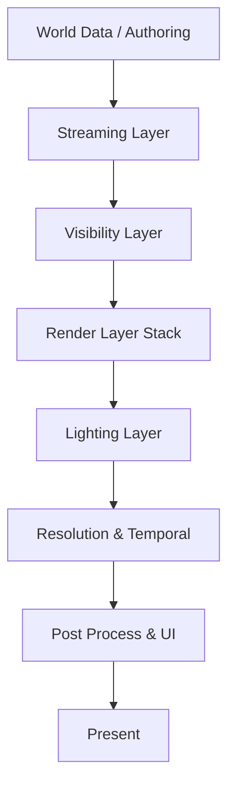
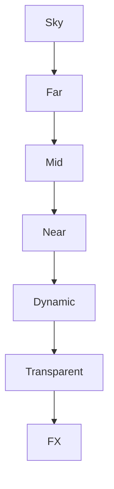
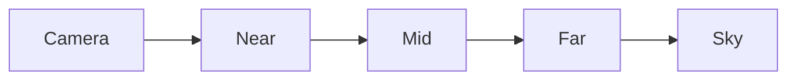

<!--more-->

# UE4 / UE5 Rendering Pipeline & World Organization

> 本文总结 UE4 / UE5（无论是否启用 Lumen）的完整渲染顺序，以及大型开放世界（尤其移动端）的资源组织、Streaming、LOD、Render Layer 设计。


---

# Overall Architecture



整个渲染可以理解为：

```
Authoring
    ↓
Streaming
    ↓
Visibility
    ↓
Rendering
    ↓
Lighting
    ↓
Temporal
    ↓
PostProcess
```

---

# 1. World Data / Authoring

世界最初只是资源组织。

```
World Data
├── Terrain
├── Static Meshes
├── Foliage
├── Buildings
├── Characters
└── Lighting Data
```

## Terrain

包括：

- Heightmap
- Runtime Virtual Texture
- Landscape Chunks

---

## Static Mesh

包含：

- Nanite（PC / Console）
- 普通 StaticMesh（Mobile）
- Instancing

---

## Vegetation

包括：

- Grass
- Trees
- Cards
- Cluster

---

## Buildings / Props

静态场景：

- 建筑
- 道路
- 小物件

---

## Characters

动态对象：

- Character
- NPC
- Vehicle

---

## Lighting Data

主要包括：

- Lightmaps
- Reflection Captures
- Probe
- SH Data

---

# 2. Streaming Layer

大型世界首先决定：

> **哪些资源应该进入 GPU。**

```
Streaming Layer
├── World Partition
├── Grid Cells
├── Render Radius
├── Collision Radius
├── AI Radius
├── HLOD
└── Material LOD
```

## Streaming Policy

不同系统可以拥有不同半径：

| System | Radius |
|---------|-------:|
| Rendering | 300m |
| Collision | 150m |
| AI | 80m |

因此：

玩家虽然能看到远方，

但：

- AI 不存在
- Physics 不存在
- Collision 不存在

---

## HLOD

远距离：

```
Building A
Building B
Building C
```

Bake 成：

```
HLOD Cluster
```

一次 Draw Call。

---

## Material LOD

远距离：

- 简化 Shader
- Texture Mip Bias
- 去掉 Normal
- 去掉 Detail Map

---

# 3. Visibility Layer

Streaming 完以后：

进入真正的 Visibility。

```
Visibility
├── Frustum Culling
├── HZB Occlusion
├── Cluster Culling
└── Draw Lists
```

## Frustum Culling

视锥外：

直接 Cull。

---

## HZB Occlusion

利用上一帧 Depth：

判断：

```
Building A
```

是否被：

```
Building B
```

挡住。

挡住：

不提交 Draw。

---

## Cluster Culling

Instance：

```
10000 Trees
```

不会一个一个判断。

而是：

```
Cluster
```

整体 Cull。

---

## Draw Lists

最后得到：

```
Near
Mid
Far
Sky
```

四份 Draw List。

---

# 4. Render Layer Stack

真正开始绘制。



---

## Layer 0 — Sky

包括：

- Skybox
- SkyAtmosphere
- Sun
- Moon

特点：

- 最少更新
- 最便宜

---

## Layer 1 — Far

主要：

- HLOD
- Impostor
- Billboard

特点：

几乎是假 3D。

---

## Layer 2 — Mid

包括：

- Simplified Mesh
- Cheap Material
- Instancing

目标：

降低 Pixel Cost。

---

## Layer 3 — Near

完整质量：

- 真 Geometry
- 真 Material
- 真 Lighting

但：

严格控制预算。

---

## Layer 4 — Dynamic

包括：

- Character
- NPC
- Vehicle

通常：

最后加入。

---

## Layer 5 — Transparency

包括：

- Glass
- Water
- Hair

必须控制数量。

原因：

Overdraw。

---

## Layer 6 — FX

包括：

- Niagara
- Particle
- Decal

一般限制：

- 粒子数
- Fillrate
- Lifetime

---

# 5. Lighting Layer

真正光照阶段。

```
Lighting
├── Static
├── Dynamic
├── Probe
├── Reflection
└── Shadow
```

---

## Static Lighting

移动端主要依赖：

- Lightmap
- AO

占比最高。

---

## Dynamic Lighting

通常：

```
1 Directional Light
```

最多：

```
1~2 Cascades
```

---

## Probe

动态物体：

使用：

- SH
- Probe Volume

而不是实时 GI。

---

## Reflection

主要：

- Reflection Capture
- Prefiltered Cubemap

通常：

不用 SSR。

---

## Shadow

一般：

```
CSM
```

角色：

```
Capsule Shadow
```

或者：

```
Blob Shadow
```

---

# 6. Resolution & Temporal

控制 GPU Budget。

```
Resolution
├── Dynamic Resolution
├── Upscale
├── TAA
└── Fixed-rate Update
```

---

## Dynamic Resolution

例如：

```
100%
 ↓
70%
 ↓
60%
```

GPU 超预算时：

自动降低 Resolution。

---

## Upscale

移动端通常：

- FSR-like
- TSR Lite
- TAA Lite

---

## History

只保留有限历史：

避免：

- Ghosting
- Heavy Reprojection

---

## Fixed-rate Update

昂贵系统：

例如：

```
Reflection

Cloud

Probe
```

每：

```
N Frames
```

更新一次。

---

# 7. Post Process

最后：

```
Tonemap
↓

Bloom

↓

Color

↓

UI

↓

Present
```

一般包括：

- Tonemap
- Color Grading
- Bloom（可选）
- UI

---

# 8. UE4 / UE5 Complete Render Pass Order

下面是真正高层 Render Pass 顺序。

```text
Frame Begin
│
├── Build Views / Visibility
│
├── Shadow Depth Pass
│
├── PrePass (Optional)
│
├── BasePass (GBuffer + Depth)
│
├── Early Lighting Prep
│      ├── SSAO
│      ├── DFAO
│      └── Skylight
│
├── Lighting Pass
│
├── SkyAtmosphere
│      ├── LUT
│      ├── SkyView LUT
│      └── Atmosphere Combine
│
├── Volumetric Fog
│      ├── Global Scattering
│      └── Fog Raymarch
│
├── Volumetric Clouds
│      ├── Cloud Trace
│      ├── Cloud Lighting
│      └── Cloud Composite
│
├── Translucency
│
├── Post Process
│
├── UI
│
└── Present
```

> **注意：**
>
> SkyAtmosphere、Volumetric Fog、Volumetric Cloud 都发生在 **BasePass 与 Lighting 完成之后**，并在 **Translucency 之前** 完成合成。

---

# 9. Four-Ring World Design (Recommended for Mobile)

大型开放世界通常不是统一质量。

而是：

按照距离拆成四圈。



---

## Near (0–30m)

```
True Geometry
True Material
```

特点：

- Full Quality
- 真几何
- 真材质
- 真法线

预算：

严格限制。

---

## Mid (30–150m)

```
Simplified Geometry

+

Cheap Material
```

特点：

- Mesh LOD
- Material LOD
- 强 Instancing
- 合批

---

## Far (150–1000m)

主要：

```
HLOD

+

Impostor
```

几乎：

```
Fake 3D
```

只保留轮廓。

---

## Sky (∞)

包括：

- Sky Dome
- Skybox
- Atmosphere

几乎：

静态。

---

# 10. Distance Ring Summary

| Ring | Distance | Geometry | Material | Update Frequency |
|------|---------:|----------|----------|-----------------|
| Near | 0–30m | Full Detail | Full PBR | Every Frame |
| Mid | 30–150m | Simplified Mesh | Simplified Material | Every Frame |
| Far | 150–1000m | HLOD / Impostor | Extremely Cheap | Low Frequency |
| Sky | ∞ | Sky Dome | Sky Material | Almost Static |

---

# 11. Key Design Principles

> 大型世界的性能优化，本质上不是“优化 DrawCall”，而是**按距离管理资源、按层控制预算**。

核心思想包括：

- **Streaming**：只加载需要的数据。
- **Visibility**：只渲染可见对象。
- **Layered Rendering**：按层组织渲染内容。
- **Distance Rings**：不同距离使用不同资源形态。
- **Lighting Budget**：静态光照优先，动态光照受限。
- **Temporal Budget**：昂贵系统降低更新频率。
- **Post Budget**：后处理保持极简，优先保证帧率。