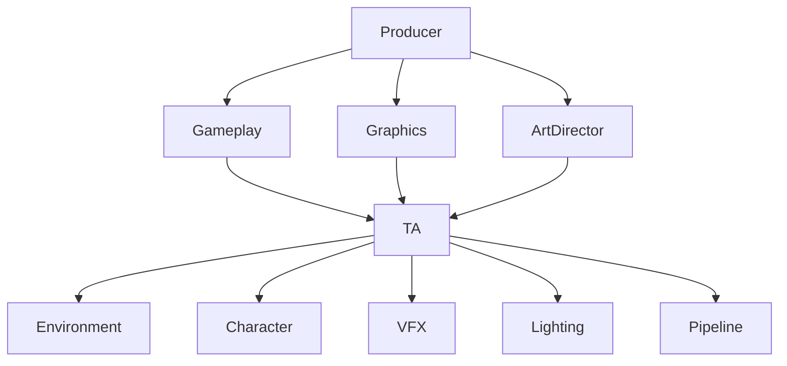
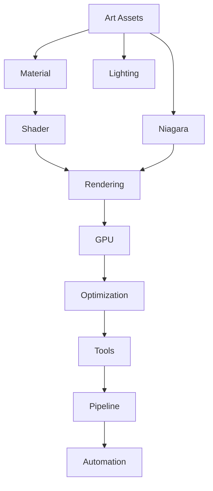

<!--more-->

# Technical Artist（TA）完全指南

> Technical Artist（TA，技术美术）是游戏开发中连接**程序（Engineering）**与**美术（Art）**之间的桥梁。
>
> 他们既理解图形技术、渲染与性能，也理解美术制作流程、工具链与资产规范，负责在**视觉效果、性能预算、开发效率**之间取得最佳平衡。


---

# 一句话理解 TA

> **程序负责让游戏能运行，美术负责让游戏好看，而 TA 负责让游戏既好看又跑得快。**

---

# TA 在团队中的位置



TA 并不是程序，也不是美术，而是连接双方的重要桥梁。

---

# TA 的职责

可以简单理解为：

```
Rendering
Shader
Lighting
VFX
Optimization
Pipeline
Tools
Automation
```

不同公司划分有所不同，但核心职责通常包含下面几个方向。

---

# 1. Shader & Material

这是最常见的 TA 工作。

UE 中：

```text
Material
      ↓
Material Function
      ↓
Shader
      ↓
HLSL
```

TA 负责：

- Master Material
- Material Function
- Material Instance
- Custom HLSL
- Shader Feature

例如：

- Dissolve
- Water
- Snow
- Wet Surface
- Wind
- Toon
- Outline
- Fresnel

例如树叶摆动：

```text
Vertex Offset

↓

World Position Offset
```

大部分都是 TA 完成。

---

# 2. Visual Effects（VFX）

现代 UE：

```
Niagara
```

Unity：

```
VFX Graph
```

TA 制作：

- 火焰
- 爆炸
- 魔法
- 烟雾
- 雨雪
- 能量球

同时控制：

- Particle Count
- GPU Cost
- Overdraw
- Fill Rate

目标：

视觉效果最大化，

GPU 消耗最小化。

---

# 3. Lighting

TA 通常负责整个项目的光照质量。

包括：

```
Lightmap

Reflection Capture

Exposure

LUT

Color Grading
```

例如：

```
为什么这里太暗？

为什么曝光炸了？

为什么天空偏蓝？
```

一般由 TA 调整。

---

# 4. Performance Optimization

这是高级 TA 最重要的工作之一。

GPU Profiling：

```
BasePass

↓

Shadow

↓

Lighting

↓

Fog

↓

PostProcess
```

TA 需要回答：

> GPU 为什么从 **8ms** 变成 **18ms**？

常用工具：

```
Stat GPU

ProfileGPU

Unreal Insights

RenderDoc

PIX

Nsight
```

---

# 5. Asset Optimization

美术资源优化。

例如：

角色：

```
180k Triangles
```

TA：

```
移动端：

30k以内
```

例如：

```
Texture

8192

↓

2048
```

或者：

```
8 Materials

↓

2 Materials
```

目的：

减少：

- Draw Call
- VRAM
- Shader Cost

---

# 6. LOD / HLOD

例如：

```
LOD0

↓

LOD1

↓

LOD2

↓

HLOD

↓

Impostor
```

大量配置：

都是 TA 完成。

例如：

```
20000 棵树
```

生成：

```
Cluster

↓

HLOD

↓

Billboard
```

最终：

只有极少 Draw Call。

---

# 7. Pipeline Development

现代 TA 很多时间都在写工具。

例如：

```
Maya

↓

Python

↓

FBX

↓

UE Import
```

自动完成：

- 命名检查
- 导入
- 材质绑定
- Skeleton
- Collision
- LOD

整个资产流程自动化。

---

# 8. Tool Development

UE：

```
Editor Utility Widget

Blueprint

Python

C++
```

例如开发：

- 一键生成 LOD
- 一键生成 Collision
- 一键检查 Texture
- 一键检查 Naming
- 一键批量导入

提高整个团队效率。

---

# 9. Rendering

高级 Rendering TA 会参与：

```
RDG

RenderPass

Global Shader

Compute Shader

Virtual Shadow

Nanite

Lumen
```

甚至：

修改：

```
Renderer
```

源码。

因此：

Rendering TA 与 Graphics Programmer 的边界开始重叠。

---

# 10. Procedural Content

越来越多 TA 使用：

```
PCG

Houdini

Geometry Script

Blueprint
```

自动生成：

- 森林
- 城市
- 地形
- 道路
- 建筑

降低人工成本。

---

# TA 的分类

不同公司会进一步细分。

---

## Environment TA

负责：

```
Landscape

Vegetation

Streaming

HLOD

Virtual Texture
```

关键词：

开放世界。

---

## Character TA

负责：

```
Skeleton

Skin

Rig

Cloth

Hair

Animation
```

关键词：

角色资产。

---

## VFX TA

负责：

```
Niagara

GPU Particle

Shader

Flipbook
```

关键词：

视觉特效。

---

## Rendering TA

负责：

```
Shader

Lighting

GPU

Rendering Pipeline

Optimization
```

关键词：

渲染。

---

## Pipeline TA

负责：

```
Python

Maya API

Houdini

CI

Asset Pipeline
```

关键词：

自动化。

---

## Tools TA

负责：

```
Editor Tool

Automation

Validation

Asset Import
```

关键词：

工具开发。

---

# UE5 中 TA 的一天

上午：

```
美术：

树太卡了。
```

↓

分析：

```
Stat GPU

↓

Overdraw

↓

BasePass
```

↓

发现：

```
透明叶片过多
```

↓

优化：

```
Material
```

---

下午：

```
程序：

Streaming 爆内存。
```

↓

分析：

```
Texture Pool

↓

Mip

↓

Virtual Texture
```

↓

调整：

```
LOD

Streaming Distance
```

---

晚上：

```
策划：

需要一个新的魔法技能。
```

↓

TA：

```
Niagara

+

Shader

+

Material

+

Audio Sync
```

完成整套视觉表现。

---

# TA 需要掌握哪些技能？

| 类别 | 技能 |
|------|------|
| 引擎 | Unreal Engine、Unity |
| Shader | Material Editor、Shader Graph、HLSL |
| 图形学 | PBR、BRDF、光照、阴影、后处理、渲染管线 |
| 性能分析 | GPU Profiling、CPU Profiling、RenderDoc、Unreal Insights |
| 美术基础 | 建模、UV、贴图、法线、动画 |
| 工具开发 | Python、Blueprint、Editor Utility、C++ |
| 自动化 | Maya API、Houdini、PCG |
| 优化 | LOD、HLOD、Streaming、Occlusion、Instancing |

---

# TA 与 Graphics Programmer 的区别

很多人容易混淆这两个岗位。

| 对比项 | Technical Artist | Graphics Programmer |
|---------|------------------|---------------------|
| 核心目标 | 美术效果 + 性能 + 工作流 | 渲染引擎 + 图形算法 |
| 主要工作 | Shader、材质、工具、Pipeline、优化 | Renderer、GPU 算法、底层 API |
| 常用语言 | Python、Blueprint、HLSL、少量 C++ | C++、HLSL、Render Graph |
| 是否修改引擎 | 偶尔 | 经常 |
| 合作对象 | 美术、策划、程序 | 引擎团队、TA |

---

# 不同级别 TA 的能力模型

| 能力 | 初级 TA | 中级 TA | 高级 TA |
|------|----------|----------|----------|
| Material | ✅ | ✅ | ✅ |
| Niagara | ✅ | ✅ | ✅ |
| Shader(HLSL) | △ | ✅ | ✅ |
| Performance Profiling | △ | ✅ | ✅ |
| Python Tool | △ | ✅ | ✅ |
| Pipeline | △ | ✅ | ✅ |
| RDG | × | △ | ✅ |
| RenderPass | × | △ | ✅ |
| Global Shader | × | △ | ✅ |
| Renderer Source | × | × | ✅ |

---

# UE5 中 TA 的技术栈



---

# 学习路线建议

## 第一阶段：美术与引擎基础

学习：

- UE 编辑器
- Material
- Niagara
- Lighting
- LOD
- Landscape

---

## 第二阶段：图形基础

学习：

- PBR
- BRDF
- Shadow
- Deferred Rendering
- Forward Rendering
- Post Process

---

## 第三阶段：Shader

学习：

- HLSL
- Material Function
- Global Shader
- Compute Shader

---

## 第四阶段：性能优化

学习：

- GPU Profiling
- Draw Call
- Overdraw
- Streaming
- HLOD
- Occlusion
- Memory

---

## 第五阶段：工具开发

学习：

- Python
- Editor Utility
- Blueprint
- Asset Pipeline
- Maya API
- Houdini

---

## 第六阶段：高级 Rendering TA

学习：

- RDG（Render Dependency Graph）
- RenderPass
- Nanite
- Lumen
- Virtual Shadow Map
- Renderer 源码

---

# 总结

现代游戏 TA 已经不仅仅是"会做材质"的岗位，而是贯穿**渲染、性能、工具、自动化和美术流程**的综合技术角色。

一个优秀的 TA，能够在以下三个维度持续创造价值：

- **视觉质量（Visual Quality）**：通过 Shader、Lighting、VFX 提升画面表现。
- **性能优化（Performance）**：通过 Profiling、LOD、Streaming、资源优化确保稳定帧率。
- **生产效率（Pipeline & Tools）**：通过工具链、自动化和流程建设，让整个美术团队工作得更快、更规范。

对于 Unreal Engine 项目来说，**Rendering TA** 往往是最具技术深度的发展方向，其能力边界已经与 Graphics Programmer 高度重叠，是理解现代实时渲染与工程实践的重要岗位。