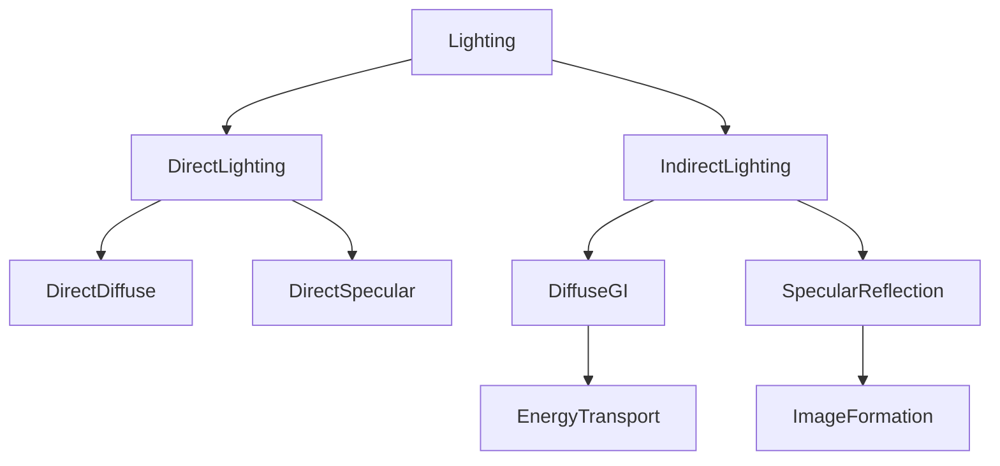
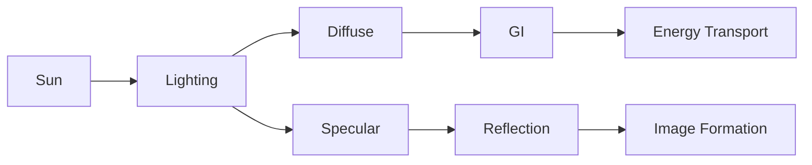

> **一句话总结**
>
> **Lighting / GI** 负责 **光能传播（Energy Transport）**；
> **Reflection / Specular** 负责 **图像形成（Image Formation）**。

---

<!--more-->

# 为什么大家容易混淆？

很多教程会这样讲：

- Reflection = 反射
- Specular = 高光
- GI = 全局光照

但实际上，这三个概念属于**完全不同的层次**。

现代 PBR 更准确的分类如下：

```text
Lighting
├── Direct Lighting
│   ├── Diffuse
│   └── Specular
│
└── Indirect Lighting
    ├── Diffuse Indirect Lighting（GI）
    └── Specular Reflection
```

真正应该理解的是：

> **Lighting 研究的是光；Reflection 研究的是图像。**

---

# Lighting（光照）

Lighting 关注的是：

> 一个点最终收到了多少光能（Radiance）。

例如：

```text
Sun
 │
 ▼
Floor
 │
 ▼
Wall
 │
 ▼
Character
```

Lighting 不关心：

> 「最后看到的是谁？」

它关心的是：

> 「还有多少光能？」

因此：

Lighting 的核心是：

- Energy（能量）
- Radiance（辐射亮度）
- Irradiance（照度）

而不是：

- Image（图像）

---

# Global Illumination（GI）

GI 的全称：

> **Global Illumination**

它表示：

> 光线在整个场景中的传播。

例如：

```text
Sun
 │
 ▼
Wall
 │
 ▼
Floor
 │
 ▼
Character
```

太阳没有直接照到角色：

```text
Sun
 │
 ▼
Wall
```

但是：

墙壁收到太阳光以后：

```text
Wall

↓↓↓↓↓↓↓

Diffuse Reflection

↓↓↓↓↓↓↓

Character
```

角色依然变亮。

这就是：

**Indirect Lighting**

也就是：

**Global Illumination**

---

# 为什么 GI 不会形成图像？

GI 几乎都是：

**Diffuse Reflection**

即：

Lambert Reflection

它会把光线：

向整个半球随机散射。

```text
        ↑
     ↗  ↑  ↖
   ←   ●   →
     ↘  ↓  ↙
```

方向信息完全丢失。

因此：

GI 最终得到的是：

```text
这里有多少光？
```

而不是：

```text
这里看到了什么？
```

---

> **结论**
>
> GI 传播的是**光能（Energy）**，
> 而不是**图像（Image）**。

---

# Reflection（反射）

Reflection 关注的是：

> 沿着某一个方向，到底看到了什么。

例如镜子：

```text
Camera

   \

    \

     Mirror

        \

         House
```

Reflection 会计算：

```text
Camera

↓

Reflection Ray

↓

House
```

于是：

镜子里面出现：

- 房子
- 天空
- 树木
- 人物

这就是：

**Image Formation**

---

# 为什么 Reflection 能形成图像？

因为：

Reflection 保留了方向。

每一个像素都会得到：

唯一一条 Reflection Ray。

例如：

```text
Pixel A

↓

Tree
```

得到：

```text
Green
```

而：

```text
Pixel B

↓

Sky
```

得到：

```text
Blue
```

所有像素组合起来：

就是完整图像。

---

# Specular（镜面反射）

很多教材把：

> Specular = 高光

其实这是一个历史遗留说法。

真正准确的是：

> **Specular Reflection（镜面反射）**

高光（Highlight）

只是其中一种表现。

例如：

```text
Light

↓

Metal Ball

↓

Camera
```

只有：

```text
Light
↓

Reflection

↓

Camera
```

三个方向刚好一致。

于是形成：

```text
Highlight
```

因此：

```text
Highlight

⊂

Specular Reflection
```

高光只是镜面反射的一部分。

---

# 现代 PBR 为什么不用 "Specular = 高光"

现代 PBR 中：

Specular 更多表示：

整个环境的镜面成像。

例如：

- 天空
- HDRI
- 建筑
- 云
- 树木

全部都会产生：

**Specular Reflection**

例如：

```text
Environment Map

↓

Specular Reflection
```

因此：

现代引擎里面：

Specular 更多表示：

> **Environment Reflection**

而不是：

> 一个亮点。

---

# GI 与 Reflection 的本质区别

| GI | Reflection |
|------|------------|
| 光能传播 | 图像形成 |
| Energy Transport | Image Formation |
| Diffuse | Specular |
| 不保留方向 | 保留方向 |
| 不形成图像 | 形成图像 |
| 间接照明 | 镜面成像 |

---

# 现代 PBR 的正确术语

现代渲染论文、Disney BRDF、Filament、UE5 等更推荐下面这些名称。

| 常见叫法 | PBR 更准确表达 |
|------------|----------------|
| GI | Diffuse Indirect Lighting |
| Reflection | Specular Reflection |
| 高光 | Direct Specular Highlight |
| 环境反射 | Specular Environment Reflection |
| 漫反射 | Diffuse Reflection |
| 光照 | Lighting |

可以看到：

> **GI** 已经越来越少单独使用。

更多论文都会写成：

- Diffuse Indirect Lighting
- Indirect Diffuse
- Specular Reflection

---

# UE5 / Lumen 中的对应关系



对应 UE5：

| UE5 功能 | 本质 |
|-----------|------|
| Lumen Global Illumination | Diffuse Indirect Lighting |
| Lumen Reflections | Specular Reflection |
| Screen Space Reflection | Specular Reflection |
| Hardware RT Reflection | Specular Reflection |

---

# 一张图理解所有概念



---

# 总结

> **一句话记忆**

- Lighting 负责让世界**亮起来**。
- GI 负责让光**传播**。
- Reflection 负责让物体**照出来**。
- Specular 是镜面反射，不只是高光。

现代 PBR 更推荐使用：

- **Diffuse Indirect Lighting** —— 漫反射能量传播
- **Specular Reflection** —— 镜面环境成像

这也是 UE5、Filament、Disney BRDF、Frostbite 等现代渲染框架采用的术语体系。