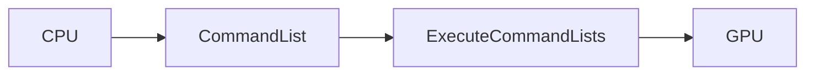
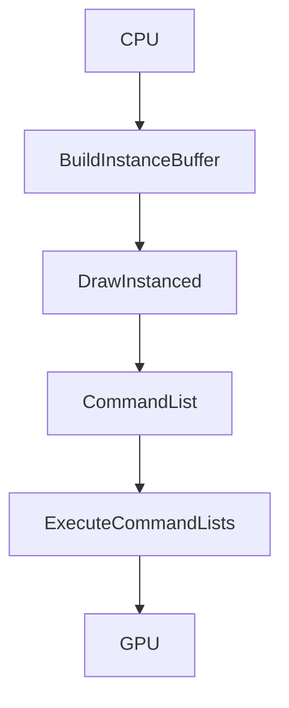
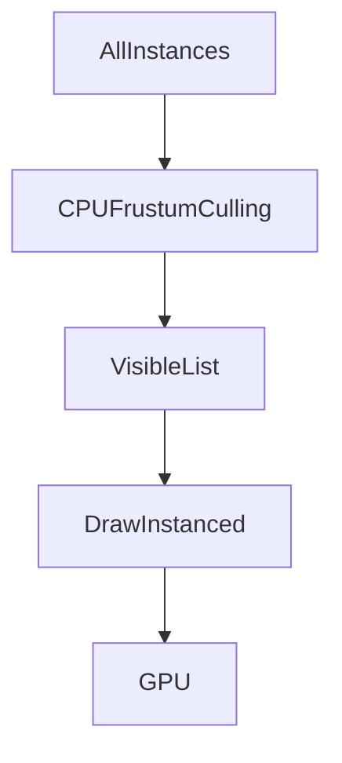
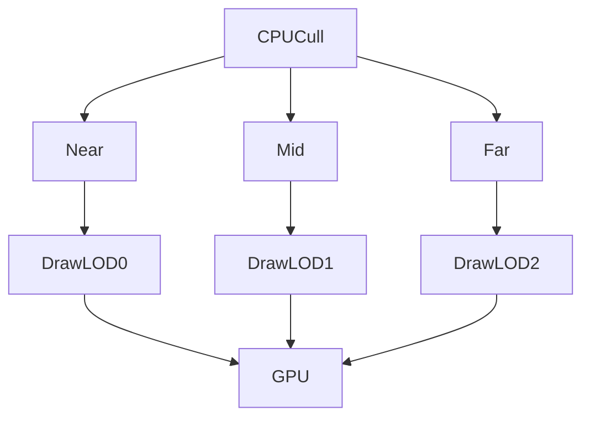
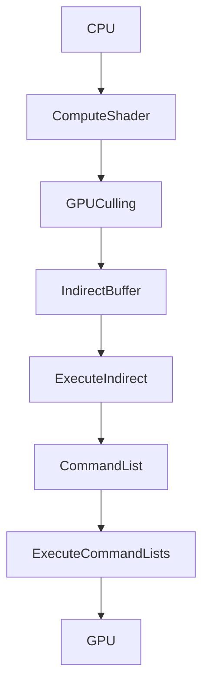
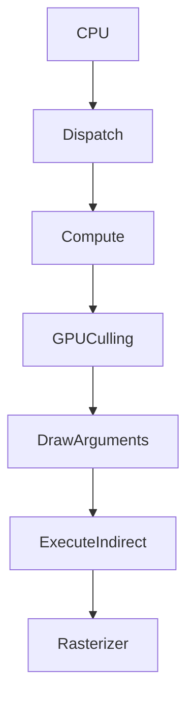

<!--more-->

# 从 DrawInstanced 到 ExecuteIndirect

现代 Renderer（UE5、Unity HDRP、Snowdrop、RE Engine、Decima 等）几乎都经历了同一条演进路线：

```text
Draw()

↓

DrawInstanced()

↓

CPU Culling

↓

CPU LOD

↓

ExecuteIndirect()

↓

GPU Culling

↓

GPU Driven Rendering

↓

Mesh Shader

↓

Nanite
```

本文重点介绍：

- DrawInstanced
- ExecuteIndirect

两种渲染方式的区别。

---

# DirectX12 渲染流程

无论哪一种 Draw。

最终都会：



注意：

真正提交 GPU 的：

始终都是：

```cpp
ExecuteCommandLists(...)
```

Draw：

只是：

向 CommandList 写命令。

---

# DrawInstanced

最经典：

```cpp
DrawInstanced(
    VertexCount,
    InstanceCount,
    StartVertex,
    StartInstance
);
```

例如：

```cpp
DrawInstanced(
    4,
    10000,
    0,
    0
);
```

表示：

```
一个 Quad

×

10000 Instance
```

---

## DrawInstanced 工作流程



CPU：

负责：

- Instance Buffer
- Instance Count

GPU：

负责：

真正 Rasterize。

---

## CPU 数据

例如：

```
Instance0

Instance1

Instance2

...

Instance9999
```

CPU：

生成：

```cpp
struct Instance
{
    float2 Position;
};
```

全部上传：

```
GPU Instance Buffer
```

---

## Vertex Buffer

仍然：

```
4 Vertex
```

```
TL

TR

BL

BR
```

不会复制：

10000 次。

---

## Vertex Shader

Vertex：

```
Quad
```

+

Instance：

```
Position
```

↓

输出：

```
世界坐标
```

例如：

```hlsl
output.pos =
    VertexPos
    +
    InstanceOffset;
```

---

## GPU

GPU：

实际上：

```
for(instance=0;instance<10000;instance++)
{
    Draw Quad
}
```

但是：

GPU 自动完成。

CPU：

没有：

```
for(...)
{
    Draw(...)
}
```

---

# CPU Frustum Culling

如果：

10000 棵树。

CPU：

可以：

```
for(instance)
{
    if(Visible)
        PushVisibleList();
}
```

得到：

```
Visible Buffer
```

例如：

```
10000

↓

3520
```

最后：

```cpp
DrawInstanced(
    4,
    3520,
    0,
    0
);
```

---

## DrawInstanced + CPU Culling



这是：

UE4 很经典的一种方式。

---

# CPU LOD

继续优化：

```
Visible

↓

Distance

↓

Near

Mid

Far
```

例如：

```
Near

120

↓

LOD0
```

```
Mid

500

↓

LOD1
```

```
Far

2000

↓

LOD2
```

CPU：

最后：

分别：

```cpp
DrawInstanced(LOD0)

DrawInstanced(LOD1)

DrawInstanced(LOD2)
```

---

## DrawInstanced + CPU LOD



---

# DrawInstanced 的问题

如果：

```
100000 Trees
```

CPU：

每帧：

都要：

```
Cull

↓

LOD

↓

Build Visible Buffer

↓

DrawInstanced()
```

CPU：

越来越忙。

特别：

开放世界。

---

# ExecuteIndirect

DX12：

增加：

```cpp
ExecuteIndirect(...)
```

最大的区别：

CPU：

不再告诉 GPU：

```
画多少
```

GPU：

自己决定。

---

## ExecuteIndirect 工作流程



注意：

CPU：

只有：

```
ExecuteIndirect()
```

这一句。

真正：

Draw Count：

GPU：

自己决定。

---

# GPU Culling

GPU：

例如：

```
100000 Tree
```

Compute Shader：

```
Thread0

Thread1

Thread2

...

Thread99999
```

每个线程：

负责：

一个 Instance。

例如：

```
Visible?

↓

Yes

↓

Append Buffer
```

否则：

```
Discard
```

---

## Indirect Buffer

GPU：

最后：

生成：

```
Instance0

Instance7

Instance22

...

Instance3121
```

然后：

写成：

```
Indirect Command Buffer
```

---

# ExecuteIndirect

CPU：

只有：

```cpp
ExecuteIndirect(...)
```

GPU：

自己：

```
Read Indirect Buffer

↓

Read Count Buffer

↓

Draw()
```

CPU：

根本不知道：

```
画了多少。
```

---

# GPU Driven Rendering

真正：

现代 Renderer：

都是：



CPU：

几乎：

不参与：

Draw。

---

# UE5 对应关系

## DrawInstanced

```
Foliage

↓

ISM

↓

HISM

↓

DrawInstanced()
```

特点：

CPU：

负责：

- Culling
- LOD
- Draw

---

## ExecuteIndirect

```
GPU Scene

↓

Instance Culling

↓

Compute Shader

↓

ExecuteIndirect()
```

特点：

GPU：

负责：

- Culling
- Draw Count
- Draw

CPU：

只负责：

Dispatch。

---

# UE5 Nanite

Nanite：

进一步：

变成：

```
Cluster

↓

Compute Shader

↓

Cluster Culling

↓

ExecuteIndirect

↓

Rasterizer
```

CPU：

甚至：

不知道：

最后：

画多少：

Cluster。

---

# DrawInstanced vs ExecuteIndirect

| 项目 | DrawInstanced | ExecuteIndirect |
|------|---------------|----------------|
| Draw Count | CPU 指定 | GPU 决定 |
| Culling | CPU | GPU |
| LOD | CPU | GPU（或混合） |
| Instance Buffer | CPU 更新 | GPU 更新 |
| Draw Call | CPU Record | GPU Argument Buffer |
| CPU 开销 | 高 | 很低 |
| GPU 开销 | 中 | 略高（Compute） |
| 适合 | 中小场景 | 大型开放世界 |

---

# 演进关系


---

# 总结

DrawInstanced：

> CPU 决定画什么。

CPU：

负责：

- Culling
- LOD
- Instance Buffer
- Draw Count

GPU：

负责：

Rasterization。

---

ExecuteIndirect：

> GPU 决定画什么。

GPU：

负责：

- Compute Culling
- Visible List
- Draw Count
- Draw Command

CPU：

只负责：

```
Dispatch

↓

ExecuteIndirect
```

---

# 学习路线建议

建议按下面顺序学习：

```
Hello Triangle

↓

DrawInstanced

↓

CPU Frustum Culling

↓

CPU LOD

↓

ExecuteIndirect

↓

GPU Culling

↓

Cluster Culling

↓

GPU Scene

↓

Mesh Shader

↓

Nanite
```

> **理解了 DrawInstanced，就理解了传统 Instancing；理解了 ExecuteIndirect，就迈入了现代 GPU Driven Rendering；再往后学习 Mesh Shader 与 Nanite，就会发现它们都是这一思想的自然延伸。**